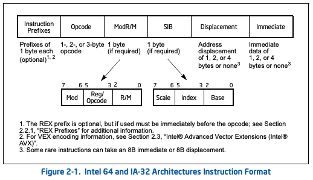

While learning more about x86_64, I went down a rabbit hole recently, and it all started with this:


<!-- more -->

For the first time, I stopped and asked myself - _"Where are these values are coming from?"_. This blog is an attempt to answer these questions for myself. A thing to note that is for the sake of simplicity and my own mental sanity, I will focus on _JUST THIS ONE ASSEMBLY_; x86_64 assembly has a lot of moving parts which change with instructions, value types and more - covering it all on a blog would be very difficult. So, we stick to just this one instruction and break down all the relevant concepts. 

## The Bible of x86_64

For this guide, we would refer to [Intel® 64 and IA-32 Architectures Software Developer’s Manual (Combined Volumes: 1, 2A, 2B, 2C, 2D, 3A, 3B, 3C, 3D, and 4)](https://www.intel.com/content/www/us/en/developer/articles/technical/intel-sdm.html) which I will refer to as _THE BOOK_ throughout this guide.

## The Three Bytes


48          01          D8
REX prefix  Opcode      ModR/M byte


There are three bytes we need to consider. Starting with the first one:

## The REX Prefix: `0x48`

First things first: _WTH is a REX prefix?_ 

Searching for the phrase "REX Prefix" in the book gives us 248 results. Here are some snippets which helped me understand what it does:


> [3-2 Vol. 1] REX prefixes allow a 64-bit operand to be specified when operating in 64-bit mode. By using this mechanism, many existing instructions have been promoted to allow the use of 64-bit registers and 64-bit addresses.

> [Vol. 1 3-19] REX prefixes consist of 4-bit fields that form 16 different values. The W-bit field in the REX prefixes is referred to as REX.W. If the REX.W field is properly set, the prefix specifies an operand size override to 64 bits. 

Before going further, lets see how `0x48` looks as a Base2 number:

```
(0x48)₁₆ =  (01001000)₂
```

We will divide this in two parts: `0100` and `1000`

The first `0100` is fixed and identifies this byte as a REX prefix. Why `0100`? Mostly due to [historical recycling choices](https://stackoverflow.com/a/36510865). 

This leaves out the `1000` part. From `Vol. 1 3-19` we can see that they are a part of the 4 bit field in the following order:

```
Bits:       | 3 | 2 | 1 | 0 |
            +---+---+---+---+ 
REX Bit:    | W | R | X | B |
            +---+---+---+---+ 
Value:      | 1 | 0 | 0 | 0 |
```

So what are `REX.W`, `REX.R`, `REX.X` and `REX.B`?

- `REX.W` (Width): Changes the operand size from the legacy 32-bits to 64-bits. This is the only bit that alters execution size rather than just targeting a register. Since we are looking at 64 bit code - this is set to `1` (See: Vol. 1 3-19)

- `REX.R` (Register): Extends the `modR/M` reg field. It allows the instruction to access the higher 8 General Purpose Registers (GPRs) `R8–R15`, as well as extended XMM/YMM registers - we dont need any of this complex stuff for this particular case as we just working with `rax` and `rbx` - so it is set to `0`.

- `REX.X` (Index): Extends the `SIB` index field. It is used specifically in complex memory addressing modes to utilize the extended GPRs as the scale/index register. Again, we dont use any of these complex fields, so it is set to `0`.

- `REX.B` (Base): Extends the `modR/M r/m` field or the `SIB` base field. Similar to `REX.R`, this allows the source/destination operands to be mapped to the `R8–R15` registers, and therefore, for our case, it is `0`.

So, this is why we get the `1000` value. So together with `0100`, we get `01001000` - the `0x48` byte we see. That's one mystery solved. 

----

Now, instead of going the next Opcode byte, we would take a look at the third piece of the puzzle: the `Mod R/M` byte. This would help us better understand the Opcode byte later. 

----

## The Mod R/M byte: `D8`

The book describes the `Mod R/M` byte as follows: 

```
[Vol. 2A 2-3]

The ModR/M byte contains three fields of information:
- The mod field combines with the r/m field to form 32 possible values: eight registers and 24 addressing modes.
- The reg/opcode field specifies either a register number or three more bits of opcode information. The purpose of the reg/opcode field is specified in the primary opcode.
- The r/m field can specify a register as an operand or it can be combined with the mod field to encode an addressing mode. Sometimes, certain combinations of the mod field and the r/m field are used to express opcode information for some instructions.

```

There is also something called an `SIB` byte, but we wont need that for our chosen example. Again, let's convert the value to Base 2:

```
(0xD8)₁₆ =  (11011000)₂
```

Now, if we take a look at Figure 2-1 from the book:



Focus on the Mod R/M byte expansion. So, if were to dividie the bits as shown, we would get:


```
Bits:       | 7 | 6 | 5 | 4 | 3 | 2 | 1 | 0 |
            +---+---+---+---+---+---+---+---+ 
0xDB:       | 1 | 1 | 0 | 1 | 1 | 0 | 0 | 0 |
            +---+---+---+---+---+---+---+---+ 
            |  Mod  |    Reg    |    R/M    |
```

### The Mod bits

The Mod bits tell the system about the nature of the operands - aka if you are adding to a register, address, offset, etc. It can take one of the 4 values:

| MOD | Example |  Description |
|-----|-------------|---------|
| 00  | `add [rax], rbx` | Memory Address Mode (No Displacement) - the operand represents a memory location using the register as the base address | 
| 01 | `add [rax+0x10], rbx` | Memory Address + 8-bit Displacement - Points to memory with an 8-bit signed value added to the base register |
| 10 | `add [rax+0x10000]` |  Memory Address + 32-bit Displacement. Points to memory with a 32-bit signed value added to the base register | 
| 11 | `add rax, rbx` | Register Direct Mode - the operands are both registers - which is the case for us |

Therefore, we understand why the bits for Mod are `11`.

### The Reg and R/M bits

These are 3 bit values which act as selectors. Essentially, it tells the system which registers we are dealing with at the moment (we will talk about directionality later when we see the opcode part). Usually, they are combined with the REX prefix (REX.B extends R/M, and REX.R extends Reg) to act as a 4 bit selector - with 16 options.

In our case, since both of them are zero, we can condense the values to: 

```
  3-bit code   Register (64-bit)
    000          RAX
    001          RCX
    010          RDX
    011          RBX
    100          RSP *
    101          RBP *
    110          RSI
    111          RDI

*NOTE: there is a bit more nuance here with the SIB stuff - but I will leave it for now (it's late here and i think i am a bit sleepy)
```

So for our case, 
- `Reg` is `011` aka `RBX`
- `R/M` is `000` aka `RAX`

So with everything combined - we get `11 011 000` aka `0xD8` - the third byte has been demystified! Finally the last piece - the OPCODE byte!

## Opcode Byte: 0x01


