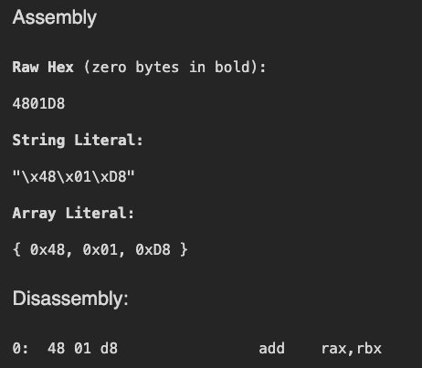

While learning more about x86_64, I went down a rabbit hole recently, and it all started with this:



<!-- more -->

For the first time, I stopped and asked myself - _"Where are these values are coming from?"_. This blog is an attempt to answer these questions for myself. A thing to note that is for the sake of simplicity and my own mental sanity, I will focus on _JUST THIS ONE ASSEMBLY_; x86_64 assembly has a lot of moving parts which change with instructions, value types and more - covering it all on a blog would be very difficult. So, we stick to just this one instruction and break down all the relevant concepts. 

## The Three Bytes

```
48          01          D8
REX prefix  Opcode      ModR/M byte
```